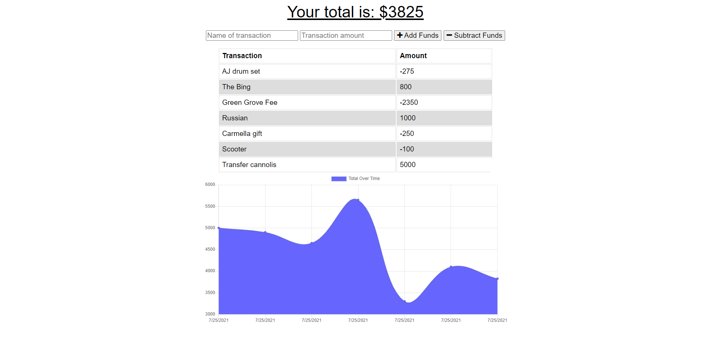

# Budget Tracker PWA

## Project Link

[_View my project here_](https://progressive-budget-tracker-1.herokuapp.com/)

## Table of Contents

- [_Project Link_](#project-link)
- [_About my Project_](#about-my-project)
- [_Installation_](#installation)
- [_Screenshots_](#screenshots)

## About my Project

For this project I added functionality to an existing Budget Tracker application to allow for offline access and functionality.
The user is able to add expenses and deposits to their budget, regardless if online or offline. A user can add entries without a connection and they are added to the budget, once connection is resumed.

## Installation

```
git clone git@github.com:misha244/budget-tracker-pwa.git
cd budget-tracker-pwa
code .
npm i
npm run start
```

## Screenshots



## Fin
